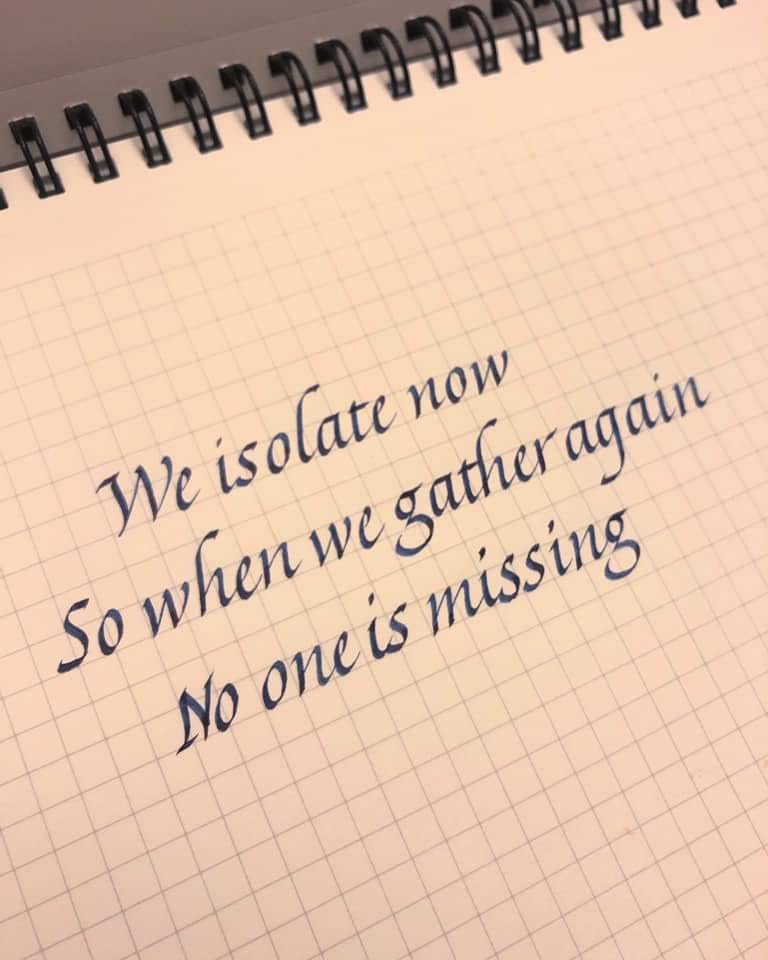

# {{ frontmatter.title }}

This haiku sums up 2020 well.

> We isolate now  
> So when we gather again  
> No one is missing  
> \- Meria Marom

[Source](https://covid-19archive.org/s/archive/item/17581)

